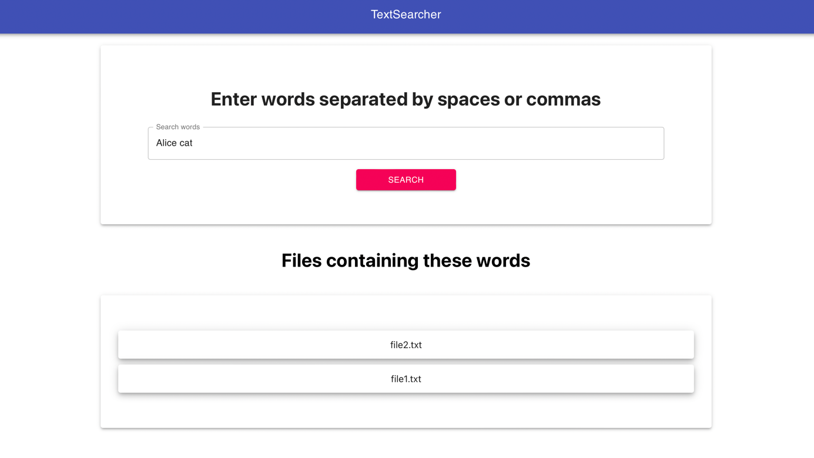
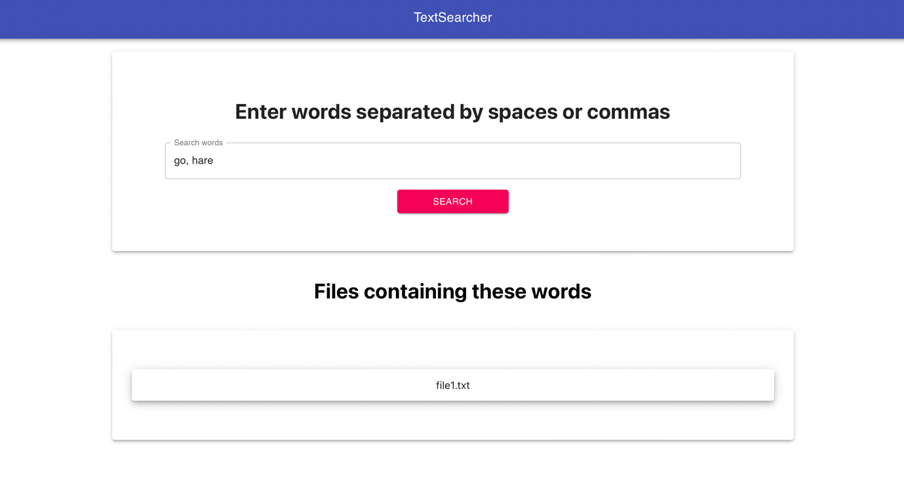

# TextSearcher

## About project
TextSearcher is a simple web application for searching text.

User can choose a folder from their disk with a set of documents, each of which is a separate file in this folder.
All documents look just like txt files in format “file_name.txt” and there are no other subfolders in the folder.
The path to the folder is set by the environment variable. 
User enters a set of words using web interface and is returned the names of all documents that contain these words.

## Run the application
0. Install JDK 17, Gradle, Node
1. Create the **permanent** environment variable `SOURCE_FOLDER_PATH` with value of the absolute path to folder.

   (E.g. `SOURCE_FOLDER_PATH={your path to project folder}/src/test/resources/test_data`. There are some files with "Alice in Wonderland" quotes.)

   If the environment variable with different name is needed, change its name in `./src/main/resources/application.propeties` file.
2. `./run.sh` to run the application
3. Go to [localhost:8080](http://localhost:8080/) 

## How it looks like

